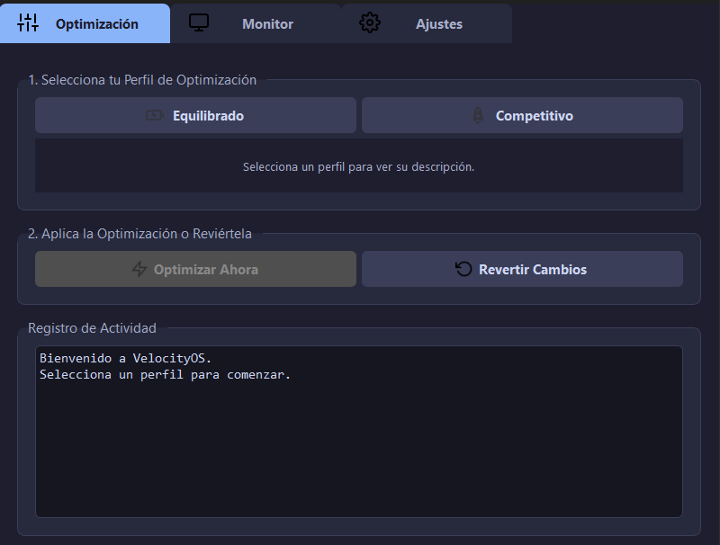
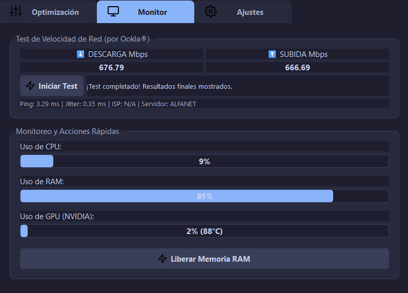
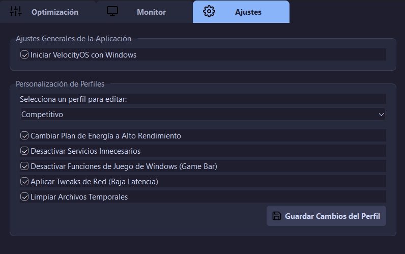

  
  
<strong>La suite de optimización definitiva para gamers en Windows 10 y 11.</strong>

  
Maximiza tus FPS, minimiza tu latencia y toma el control de tu sistema con un solo clic.

  
  

    
    
    
    
  

---

**VelocityOS** es una herramienta todo-en-uno diseñada desde cero por **Álex Macías León** para dar a los jugadores de PC el poder de optimizar su sistema para un rendimiento de juego sin compromisos. Ya sea que compitas en e-sports o disfrutes de títulos AAA, VelocityOS ajusta tu sistema para que puedas concentrarte en lo que importa: jugar.

  

## ✨ ¿Por Qué VelocityOS?

| Característica                 | Descripción                                                                                                                              |
| ------------------------------ | ---------------------------------------------------------------------------------------------------------------------------------------- |
| 🚀 **Perfiles Inteligentes**     | Elige entre perfiles como **Competitivo** o **Equilibrado**. O personalízalos a tu gusto en la pestaña de Ajustes.                       |
| ⚙️ **Optimización Profunda**     | Ajusta planes de energía, desactiva servicios, limpia archivos temporales y modifica el registro para eliminar cuellos de botella.      |
| 🌐 **Diagnóstico de Red**        | Incluye un **test de velocidad preciso** (potenciado por Ookla®) y un monitor de latencia para diagnosticar problemas de conexión al instante. |
| 📊 **Monitoreo en Tiempo Real**  | Mantén un ojo en el uso de tu **CPU, RAM y GPU (NVIDIA)** con un panel de monitoreo claro y conciso.                                     |
| ⏪ **Totalmente Reversible**     | Cada cambio realizado por los perfiles de optimización se puede revertir con un solo clic, devolviendo tu sistema a su estado original. |
| 🛡️ **Seguro y Transparente**    | Sin software dudoso ni modificaciones ocultas. VelocityOS te informa de cada acción en su registro de actividad.                       |

  

## ⬇️ Instalación

1.  Dirígete a la página de [**Releases**](https://github.com/LexDevM/VelocityOS/releases) de este repositorio.
2.  Descarga el último instalador `VelocityOS_vX.X.X_Setup.exe`.
3.  Ejecuta el instalador. Si lo pide, se requerirán **permisos de administrador**, ya que la aplicación necesita modificar ajustes del sistema para funcionar correctamente.

> **Nota:** Tu sistema operativo puede mostrar una advertencia de seguridad (Windows SmartScreen) porque la aplicación no está firmada digitalmente. Esto es normal para proyectos independientes. Simplemente haz clic en "Más información" y luego en "Ejecutar de todas formas".

## 📖 Guía Rápida

1.  **Selecciona un Perfil:** En la pestaña `Optimización`, elige el perfil que mejor se adapte a tu sesión de juego.
2.  **Optimiza:** Haz clic en `Optimizar Ahora`.
3.  **Juega:** ¡Disfruta de tu sistema optimizado!
4.  **Restaura (Opcional):** Cuando termines, haz clic en `Revertir Cambios` para devolver todo a la normalidad.
5.  **Diagnostica:** Usa la pestaña `Monitor` para revisar el estado de tu hardware y realizar un test de velocidad si experimentas lag.
6.  **Personaliza:** Ve a la pestaña `Ajustes` para activar o desactivar optimizaciones específicas de cada perfil o para configurar el inicio con Windows.

  

## 🛠️ Stack Tecnológico

Este proyecto fue posible gracias a las siguientes tecnologías:

- **Lenguaje:** 
- **Interfaz Gráfica:** 
- **Análisis de Sistema:** 
- **Empaquetado:** 
- **Instalador:** 
- **Test de Velocidad:** Potenciado por **Ookla® Speedtest® CLI**.

## 🤝 Contribuciones

¡Las contribuciones son el corazón del open source y son muy bienvenidas! Si tienes ideas para nuevas optimizaciones, mejoras en la interfaz o encuentras algún bug, nos encantaría saber de ti.

Para asegurar un proceso fluido y mantener la calidad del proyecto, por favor, sigue estos pasos:

1.  **Consulta la Guía para Desarrolladores:** Antes de empezar, lee nuestro archivo [**CONTRIBUTING.md**](CONTRIBUTING.md). Contiene toda la información sobre la arquitectura del proyecto, cómo configurar tu entorno de desarrollo y las pautas para añadir nuevo código.
2.  **Abre un Issue:** Antes de realizar un cambio importante, abre un [**Issue**](https://github.com/LexDevM/VelocityOS/issues) para discutir la idea. Esto nos permite asegurarnos de que tu contribución se alinea con la dirección del proyecto.
3.  **Crea un Fork y un Pull Request:** Realiza tus cambios en un *fork* de este repositorio y luego abre un *Pull Request* para que podamos revisar e integrar tu trabajo.

¡Toda ayuda es valiosa y será reconocida!

## 📜 Licencia

Distribuido bajo la Licencia MIT. Consulta `LICENSE.txt` para más información.

---

  Creado con ❤️ por <strong>LexDevM</strong>

